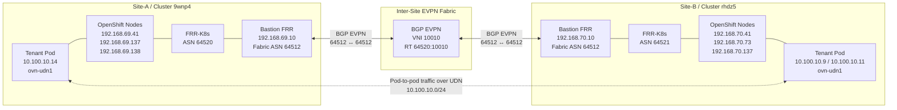

# OpenShift 4.22 UDN EVPN Lab

A hands-on lab for building and validating an inter-site EVPN fabric for OpenShift 4.22 `ClusterUserDefinedNetwork` using FRR, OVN-Kubernetes, FRR-K8s and bastion-based routing.

The goal of this lab is to prove that two OpenShift clusters can advertise and learn EVPN MAC/IP routes for the same primary tenant Layer 2 network, then pass pod-to-pod traffic across sites over the UDN interface.

> **Note**
>
> This is a lab and learning environment. The final working pattern below was validated in a VMware-based workshop-style setup. For production use, always validate against the supported OpenShift platform and networking guidance for your target version.

---

## What This Lab Builds

This lab creates two OpenShift clusters, each with:

- A primary `ClusterUserDefinedNetwork`
- A tenant namespace using `ovn-udn1`
- FRR-K8s speakers on the OpenShift nodes
- A bastion FRR router acting as the local EVPN fabric peer
- Inter-site EVPN BGP peering between the two bastions
- Remote EVPN Type-2 and Type-3 route learning
- Cross-site pod-to-pod traffic over the tenant UDN

---

## High-Level Architecture



---

## Final Working Design

The final working design uses different OpenShift FRR-K8s ASNs per site, but a shared EVPN route target.

| Component | Site-A | Site-B |
|---|---:|---:|
| Cluster name | `9wnp4` | `rhdz5` |
| Base domain | `dynamic2.redhatworkshops.io` | `dynamic2.redhatworkshops.io` |
| Underlay subnet | `192.168.69.0/24` | `192.168.70.0/24` |
| Bastion underlay IP | `192.168.69.10` | `192.168.70.10` |
| Bastion / fabric ASN | `64512` | `64512` |
| OpenShift FRR-K8s ASN | `64520` | `64521` |
| EVPN VNI | `10010` | `10010` |
| EVPN route target | `64520:10010` | `64520:10010` |
| Tenant namespace | `tenant-a` | `tenant-a` |
| Tenant subnet | `10.100.10.0/24` | `10.100.10.0/24` |

---

## Why the ASNs Are Different

Site-A and Site-B must not use the same OpenShift FRR-K8s ASN.

If both clusters use `64520`, remote EVPN routes can be rejected by BGP loop prevention because the receiving OpenShift FRR speaker sees its own ASN in the AS path.

The working design is:

```yaml
# Site-A
ocp_bgp_asn: 64520

# Site-B
ocp_bgp_asn: 64521
```

The EVPN route target must remain shared across both sites:

```yaml
evpn_route_target_base: 64520
```

This keeps both clusters importing and exporting the same tenant EVPN route target:

```text
64520:10010
```

---

## Required Inter-Site Routes

The bastions need routes to the full remote underlay subnet, not only to the remote bastion `/32`.

A `/32` route to the remote bastion is enough to establish BGP, but it is not enough for the EVPN data plane. The EVPN next-hops are the remote OpenShift node VTEPs, so each side must be able to reach the full remote underlay subnet.

Site-A FRR requires:

```text
ip route 192.168.70.0/24 192.168.69.1
neighbor 192.168.70.10 remote-as 64512
```

Site-B FRR requires:

```text
ip route 192.168.69.0/24 192.168.70.1
neighbor 192.168.69.10 remote-as 64512
```

---

## Repository Layout

```text
ocp422-udn-evpn-lab/
├── ansible.cfg
├── Makefile
├── requirements.yml
├── inventories/
│   └── lab/
│       ├── hosts.yml
│       └── group_vars/
│           ├── all/
│           │   ├── vars.yml
│           │   └── vault.yml
│           ├── site_a.yml
│           └── site_b.yml
├── playbooks/
│   ├── 01_prepare_bastion.yml
│   ├── 02_vsphere_discover.yml
│   ├── 03_render_install_config.yml
│   ├── 04_install_cluster.yml
│   ├── 05_configure_evpn.yml
│   ├── 06_deploy_test_workloads.yml
│   └── 07_verify.yml
├── templates/
│   ├── install-config.yaml.j2
│   ├── frr.conf.j2
│   ├── evpn-vxlan.service.j2
│   └── manifests/
│       ├── vtep.yaml.j2
│       ├── frrconfiguration.yaml.j2
│       ├── routeadvertisements.yaml.j2
│       ├── cudn.yaml.j2
│       └── test-pod.yaml.j2
└── docs/
    └── topology.md
```

---

## Site Variables

### Site-A

```yaml
cluster_name: "9wnp4"
base_domain: "dynamic2.redhatworkshops.io"

subnet_cidr: "192.168.69.0/24"
api_vip: "192.168.69.201"
ingress_vip: "192.168.69.202"

ocp_bgp_asn: 64520
evpn_route_target_base: 64520

intersite_remote_underlay_cidr: "192.168.70.0/24"
intersite_remote_gateway: "192.168.69.1"
intersite_remote_bastion_ip: "192.168.70.10"
```

### Site-B

```yaml
cluster_name: "rhdz5"
base_domain: "dynamic2.redhatworkshops.io"

subnet_cidr: "192.168.70.0/24"
api_vip: "192.168.70.201"
ingress_vip: "192.168.70.202"

ocp_bgp_asn: 64521
evpn_route_target_base: 64520

intersite_remote_underlay_cidr: "192.168.69.0/24"
intersite_remote_gateway: "192.168.70.1"
intersite_remote_bastion_ip: "192.168.69.10"
```

---

## Make Targets

| Target | Example | Description |
|---|---|---|
| `prepare` | `make prepare SITE=site_a` | Prepares the bastion host. |
| `discover` | `make discover SITE=site_a` | Discovers vSphere objects. |
| `render` | `make render SITE=site_a` | Renders OpenShift install config. |
| `install` | `make install SITE=site_a` | Starts OpenShift installation. |
| `evpn` | `make evpn SITE=site_a` | Configures FRR, EVPN, VTEP, RouteAdvertisements and CUDN. |
| `test` | `make test SITE=site_a` | Deploys tenant test pods. |
| `verify` | `make verify SITE=site_a` | Verifies cluster, EVPN and access status. |

---

## Deployment Flow

Run the workflow for each site.

### Site-A

```bash
make prepare SITE=site_a
make discover SITE=site_a
make render SITE=site_a
make install SITE=site_a
make evpn SITE=site_a
make test SITE=site_a
make verify SITE=site_a
```

### Site-B

```bash
make prepare SITE=site_b
make discover SITE=site_b
make render SITE=site_b
make install SITE=site_b
make evpn SITE=site_b
make test SITE=site_b
make verify SITE=site_b
```

---

## Make Verify Options

The `verify` target checks the status of a deployed site.

### Basic Usage

```bash
make verify SITE=site_a
make verify SITE=site_b
```

By default, `verify` shows the cluster status, EVPN status, OpenShift Console URL, and the `kubeadmin` username.

The `kubeadmin` password is hidden by default so it is not accidentally leaked into terminal history, screenshots, Slack, Git commits, or support case logs.

### Options

| Option | Default | Example | Description |
|---|---:|---|---|
| `SITE` | `site_a` | `SITE=site_b` | Selects which site to verify. |
| `SHOW_KUBEADMIN_PASSWORD` | `false` | `SHOW_KUBEADMIN_PASSWORD=true` | Prints the `kubeadmin` password during verify. |

### Show Console URL and Username

```bash
make verify SITE=site_a
make verify SITE=site_b
```

Expected output includes:

```text
# Cluster access
Console URL:
https://console-openshift-console.apps.<cluster>.<base-domain>

Username:
kubeadmin

Password:
hidden - run: make verify SITE=<site> SHOW_KUBEADMIN_PASSWORD=true
```

### Show kubeadmin Password

Only use this when you really need the password:

```bash
make verify SITE=site_a SHOW_KUBEADMIN_PASSWORD=true
make verify SITE=site_b SHOW_KUBEADMIN_PASSWORD=true
```

---

## Validation Commands

### Check Bastion EVPN BGP

Site-A:

```bash
ansible site-a-bastion   -m shell   -a 'sudo vtysh -c "show bgp l2vpn evpn summary"'   --ask-vault-pass -o
```

Site-B:

```bash
ansible site-b-bastion   -m shell   -a 'sudo vtysh -c "show bgp l2vpn evpn summary"'   --ask-vault-pass -o
```

Expected:

```text
Site-A node peers: AS 64520 up
Site-B node peers: AS 64521 up
Site-A <-> Site-B bastion peer: AS 64512 up
```

### Check Remote EVPN Routes on Site-A

```bash
ansible site-a-bastion   -m shell   -a 'sudo vtysh -c "show bgp l2vpn evpn" | egrep "192.168.70|10.100.10.9|10.100.10.11|RT:64520:10010"'   --ask-vault-pass -o
```

### Check Remote EVPN Routes on Site-B

```bash
ansible site-b-bastion   -m shell   -a 'sudo vtysh -c "show bgp l2vpn evpn" | egrep "192.168.69|10.100.10.12|10.100.10.14|RT:64520:10010"'   --ask-vault-pass -o
```

---

## Proof of Success

A successful lab should show:

```text
Site-A local EVPN: working
Site-B local EVPN: working
Bastion-to-bastion EVPN BGP: established
Remote Type-2 EVPN routes: learned by OpenShift FRR-K8s
Pod-to-pod traffic over ovn-udn1: working both ways
```

### Site-A to Site-B Pod Ping

```bash
ansible site-a-bastion   -m shell   -a 'export KUBECONFIG=/home/lab-user/ocp422-udn-evpn-lab/artifacts/site_a/auth/kubeconfig; POD=$(oc -n tenant-a get pods -l app=evpn-test --field-selector=status.phase=Running -o jsonpath="{.items[0].metadata.name}"); oc -n tenant-a exec $POD -- ping -I ovn-udn1 -c 3 10.100.10.9'   --ask-vault-pass -o
```

### Site-B to Site-A Pod Ping

```bash
ansible site-b-bastion   -m shell   -a 'export KUBECONFIG=/home/lab-user/ocp422-udn-evpn-lab/artifacts/site_b/auth/kubeconfig; POD=$(oc -n tenant-a get pods -l app=evpn-test --field-selector=status.phase=Running -o jsonpath="{.items[0].metadata.name}"); oc -n tenant-a exec $POD -- ping -I ovn-udn1 -c 3 10.100.10.14'   --ask-vault-pass -o
```

Expected:

```text
3 packets transmitted, 3 received, 0% packet loss
```

---

## Troubleshooting Notes

### BGP Peer Stuck in Active

If the inter-site BGP peer is stuck in `Active`, check whether FRR has a route to the remote bastion.

```bash
sudo vtysh -c "show bgp neighbors <remote-bastion-ip>"
sudo vtysh -c "show ip route <remote-bastion-ip>"
ip route get <remote-bastion-ip>
```

If FRR reports:

```text
No path to specified Neighbor
```

Add the remote underlay route to FRR.

### BGP Established but Pod Ping Fails

If bastion-to-bastion BGP is established but pod ping fails, check whether the OpenShift FRR-K8s pod has learned the remote Type-2 routes.

Site-A should learn Site-B pod routes:

```bash
oc -n openshift-frr-k8s exec <frr-pod> -c frr --   vtysh -c "show bgp l2vpn evpn" | egrep "10.100.10.9|10.100.10.11"
```

Site-B should learn Site-A pod routes:

```bash
oc -n openshift-frr-k8s exec <frr-pod> -c frr --   vtysh -c "show bgp l2vpn evpn" | egrep "10.100.10.12|10.100.10.14"
```

If the routes are missing, check:

- Site-B uses a different OpenShift ASN: `64521`
- Both sites share route target: `64520:10010`
- Each bastion has a route to the full remote underlay subnet
- OCP nodes can reach remote node VTEPs

### CUDN Spec Is Immutable

If you see:

```text
The ClusterUserDefinedNetwork "tenant-a-l2" is invalid: spec.network: Invalid value: Network spec is immutable
```

Do not change the VNI, route target, topology, transport or subnet on an existing CUDN.

The working shared route target is:

```text
64520:10010
```

If the CUDN must change, delete and recreate the CUDN only when it is safe to disrupt the tenant network.

---

## Security Notes

Do not commit or paste any of the following:

```text
kubeadmin-password
kubeconfig
pull-secret
vault.yml
terminal output containing vault passwords
```

If a vault password or kubeadmin password is pasted into a chat, ticket, terminal recording, Git repository, or recording by mistake, rotate it.

Recommended `.gitignore` entries:

```gitignore
inventories/lab/group_vars/all/vault.yml
artifacts/
*.kubeconfig
kubeadmin-password
pull-secret.json
```

---

## Final Known Working State

The final known working state proved:

```text
Site-A pod 10.100.10.14 -> Site-B pod 10.100.10.9: success
Site-B pod 10.100.10.11 -> Site-A pod 10.100.10.14: success
```

Both directions passed with:

```text
3 packets transmitted, 3 received, 0% packet loss
```

This confirms the end-to-end EVPN UDN fabric is working across both OpenShift clusters.
