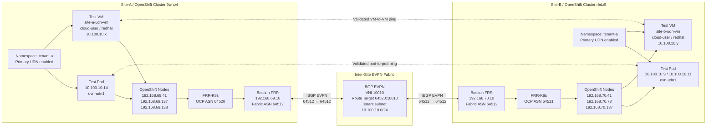

# OpenShift 4.22 UDN EVPN Lab

A hands-on lab for building and validating a stretched tenant Layer 2 network across two OpenShift 4.22 clusters using:

- `ClusterUserDefinedNetwork`
- OVN-Kubernetes primary UDN
- FRR-K8s
- Bastion-based FRR routing
- BGP EVPN
- OpenShift Virtualization
- Kubernetes NMState
- VMware nested virtualization

The lab first proves pod-to-pod connectivity across sites. It then extends the same tenant network to virtual machines running on OpenShift Virtualization.

---

## Lab Goal

The goal is to prove that a single tenant Layer 2 network can exist across two separate OpenShift clusters using a shared EVPN VNI and route target.

```text
Site-A Pod / VM
10.100.10.x
   |
Primary UDN / ovn-udn1
VNI 10010 / RT 64520:10010
   |
Site-A FRR-K8s ASN 64520
   |
Site-A Bastion FRR ASN 64512
   |
BGP EVPN inter-site
   |
Site-B Bastion FRR ASN 64512
   |
Site-B FRR-K8s ASN 64521
   |
Primary UDN / ovn-udn1
   |
Site-B Pod / VM
10.100.10.y
```

This is best described as:

> **A stretched tenant Layer 2 network over EVPN.**

It is not the same as stretching a physical VMware VLAN end-to-end.

---

## High-Level Architecture



---

## Final Working Design

| Component | Site-A | Site-B |
|---|---:|---:|
| Cluster name | `9wnp4` | `rhdz5` |
| Base domain | `dynamic2.redhatworkshops.io` | `dynamic2.redhatworkshops.io` |
| Underlay subnet | `192.168.69.0/24` | `192.168.70.0/24` |
| Bastion IP | `192.168.69.10` | `192.168.70.10` |
| Bastion / fabric ASN | `64512` | `64512` |
| OpenShift FRR-K8s ASN | `64520` | `64521` |
| EVPN VNI | `10010` | `10010` |
| EVPN route target | `64520:10010` | `64520:10010` |
| Tenant namespace | `tenant-a` | `tenant-a` |
| Tenant subnet | `10.100.10.0/24` | `10.100.10.0/24` |
| Test VM | `site-a-udn-vm` | `site-b-udn-vm` |
| VM username | `cloud-user` | `cloud-user` |
| VM password | `redhat` | `redhat` |

---

## Why Site-B Uses ASN 64521

Site-A and Site-B must not use the same OpenShift FRR-K8s ASN.

If both clusters use `64520`, remote EVPN routes can be rejected by BGP loop prevention because the receiving OpenShift FRR speaker sees its own ASN in the AS path.

Working configuration:

```yaml
# Site-A
ocp_bgp_asn: 64520
evpn_route_target_base: 64520

# Site-B
ocp_bgp_asn: 64521
evpn_route_target_base: 64520
```

The OpenShift ASNs are different, but the EVPN route target stays the same:

```text
64520:10010
```

That shared route target lets both clusters import and export the same tenant EVPN network.

---

## Required Inter-Site FRR Routes

The bastions need routes to the full remote underlay subnet, not only to the remote bastion `/32`.

A `/32` route to the remote bastion is enough to establish the BGP session, but it is not enough for the EVPN data plane. EVPN next-hops point to remote OpenShift node VTEPs, so each side must reach the full remote node underlay subnet.

### Site-A FRR

```text
ip route 192.168.70.0/24 192.168.69.1
neighbor 192.168.70.10 remote-as 64512
```

### Site-B FRR

```text
ip route 192.168.69.0/24 192.168.70.1
neighbor 192.168.69.10 remote-as 64512
```

---

## Repository Layout

```text
ocp422-udn-evpn-lab/
├── ansible.cfg
├── Makefile
├── README.md
├── requirements.yml
├── inventories/
│   └── lab/
│       ├── hosts.yml
│       └── group_vars/
│           ├── all/
│           │   ├── vars.yml
│           │   └── vault.yml
│           ├── site_a.yml
│           └── site_b.yml
├── playbooks/
│   ├── 01_prepare_bastion.yml
│   ├── 02_vsphere_discover.yml
│   ├── 03_render_install_config.yml
│   ├── 04_install_cluster.yml
│   ├── 05_configure_evpn.yml
│   ├── 06_deploy_test_workloads.yml
│   ├── 07_verify.yml
│   ├── 08_check_nested_virt.yml
│   ├── 09_enable_nested_virt_vmware.yml
│   ├── 10_install_virtualization.yml
│   ├── 11_install_nmstate.yml
│   ├── 12_deploy_udn_vms.yml
│   ├── 13_verify_udn_vms.yml
│   └── 99_destroy_cluster.yml
└── templates/
    ├── install-config.yaml.j2
    ├── frr.conf.j2
    ├── evpn-vxlan.service.j2
    └── manifests/
        ├── vtep.yaml.j2
        ├── frrconfiguration.yaml.j2
        ├── routeadvertisements.yaml.j2
        ├── cudn.yaml.j2
        └── test-pod.yaml.j2
```

---

## Current Validated State

The EVPN lab has been validated successfully for both pods and VMs.

```text
Site-A local EVPN:        Working
Site-B local EVPN:        Working
Site-A <-> Site-B BGP:    Established
Remote VTEP reachability: Working
Remote Type-2 routes:     Learned by bastions and node FRR pods
Pod-to-pod UDN ping:      Working both ways
VM-to-VM UDN ping:        Working both ways
```

Validated pod traffic:

```text
Site-A pod 10.100.10.14 -> Site-B pod 10.100.10.9: success
Site-B pod 10.100.10.11 -> Site-A pod 10.100.10.14: success
```

Validated VM traffic:

```text
Site-A VM 10.100.10.x -> Site-B VM 10.100.10.y: success
Site-B VM 10.100.10.y -> Site-A VM 10.100.10.x: success
```

Expected result:

```text
3 packets transmitted, 3 received, 0% packet loss
```

---

## Make Targets

| Target | Example | Description |
|---|---|---|
| `prepare` | `make prepare SITE=site_a` | Prepare the bastion host. |
| `discover` | `make discover SITE=site_a` | Discover vSphere details. |
| `render` | `make render SITE=site_a` | Render OpenShift install config. |
| `install` | `make install SITE=site_a` | Install OpenShift, then run a non-fatal nested virt status check. |
| `evpn` | `make evpn SITE=site_a` | Configure FRR, EVPN, VTEP, RouteAdvertisements and CUDN. |
| `test` | `make test SITE=site_a` | Deploy tenant test pods. |
| `verify` | `make verify SITE=site_a` | Verify cluster, EVPN and access status. |
| `nested-status` | `make nested-status SITE=site_a` | Check nested virtualization without failing the run. |
| `nested-check` | `make nested-check SITE=site_a` | Strict nested virtualization check. Fails if `/dev/kvm` is missing. |
| `nested-enable` | `make nested-enable SITE=site_a CONFIRM_NESTED_ENABLE=true` | Enable VMware nested virtualization one node at a time. |
| `virt` | `make virt SITE=site_a` | Install OpenShift Virtualization. |
| `nmstate` | `make nmstate SITE=site_a` | Install Kubernetes NMState Operator. |
| `vms` | `make vms SITE=site_a` | Deploy test VM attached to the primary UDN. |
| `verify-vms` | `make verify-vms SITE=site_a` | Verify VM, VM IP and EVPN route state. |
| `destroy` | `make destroy SITE=site_a CONFIRM_DESTROY=true` | Destroy one OpenShift cluster. |
| `destroy-all` | `make destroy-all CONFIRM_DESTROY=true` | Destroy both OpenShift clusters. |

> `$(SITE)` is a Makefile variable. In the shell, use `make virt SITE=site_a`, not `echo $(SITE)`.

---

## Deployment Flow

### Site-A

```bash
make prepare SITE=site_a
make discover SITE=site_a
make render SITE=site_a
make install SITE=site_a
make evpn SITE=site_a
make test SITE=site_a
make verify SITE=site_a
make nested-check SITE=site_a
make virt SITE=site_a
make nmstate SITE=site_a
make vms SITE=site_a
make verify-vms SITE=site_a
```

### Site-B

```bash
make prepare SITE=site_b
make discover SITE=site_b
make render SITE=site_b
make install SITE=site_b
make evpn SITE=site_b
make test SITE=site_b
make verify SITE=site_b
make nested-check SITE=site_b
make virt SITE=site_b
make nmstate SITE=site_b
make vms SITE=site_b
make verify-vms SITE=site_b
```

---

## Verify Options

The `verify` target checks the status of a deployed site.

```bash
make verify SITE=site_a
make verify SITE=site_b
```

By default, `verify` hides the `kubeadmin` password.

To show it when required:

```bash
make verify SITE=site_a SHOW_KUBEADMIN_PASSWORD=true
make verify SITE=site_b SHOW_KUBEADMIN_PASSWORD=true
```

---

## Nested Virtualization

### Status Check

```bash
make nested-status SITE=site_a
make nested-status SITE=site_b
```

### Strict Check

```bash
make nested-check SITE=site_a
make nested-check SITE=site_b
```

Expected success:

```text
NESTED_VIRT_STATUS=OK
Nested virtualization is available on all nodes.
```

Expected failure:

```text
NESTED_VIRT_STATUS=MISSING
/dev/kvm: MISSING
```

### Enable Nested Virtualization on VMware

```bash
make nested-enable SITE=site_a CONFIRM_NESTED_ENABLE=true
make nested-enable SITE=site_b CONFIRM_NESTED_ENABLE=true
```

The playbook updates one OpenShift node VM at a time:

```text
1. Cordon OpenShift node
2. Drain OpenShift node
3. Power off VMware VM
4. Enable nested virtualization
5. Power on VMware VM
6. Wait for OpenShift node Ready
7. Uncordon OpenShift node
8. Continue to next node
```

Do not power off all compact control-plane nodes at the same time.

---

## OpenShift Virtualization

Install OpenShift Virtualization:

```bash
make virt SITE=site_a
make virt SITE=site_b
```

If nested virtualization is not yet enabled and you only want to install the operator, bypass the strict check:

```bash
make virt SITE=site_a SKIP_NESTED_CHECK=true
make virt SITE=site_b SKIP_NESTED_CHECK=true
```

VM workloads require `/dev/kvm` to be present on the OpenShift nodes.

---

## Kubernetes NMState

Install NMState:

```bash
make nmstate SITE=site_a
make nmstate SITE=site_b
```

NMState is included to support node network inspection and future localnet / physical bridge mapping work.

---

## UDN Test VMs

Deploy the test VMs:

```bash
make vms SITE=site_a
make vms SITE=site_b
```

VM details:

| Site | VM name | Username | Password |
|---|---|---|---|
| Site-A | `site-a-udn-vm` | `cloud-user` | `redhat` |
| Site-B | `site-b-udn-vm` | `cloud-user` | `redhat` |

The VM cloud-init configuration must include:

```yaml
cloudInitNoCloud:
  userData: |
    #cloud-config
    password: redhat
    chpasswd:
      expire: false
    ssh_pwauth: true
    users:
    - name: cloud-user
      sudo: ALL=(ALL) NOPASSWD:ALL
      shell: /bin/bash
```

Open a console:

```bash
virtctl console site-a-udn-vm -n tenant-a
virtctl console site-b-udn-vm -n tenant-a
```

Login:

```text
cloud-user / redhat
```

---

## VM Validation

Check VM status and IPs:

```bash
make verify-vms SITE=site_a
make verify-vms SITE=site_b
```

Once both VM IPs are known, verify from the opposite site:

```bash
make verify-vms SITE=site_a REMOTE_VM_IP=<site-b-vm-ip>
make verify-vms SITE=site_b REMOTE_VM_IP=<site-a-vm-ip>
```

Manual console test:

```bash
virtctl console site-a-udn-vm -n tenant-a
ping -c 3 <site-b-vm-ip>
```

```bash
virtctl console site-b-udn-vm -n tenant-a
ping -c 3 <site-a-vm-ip>
```

Expected:

```text
3 packets transmitted, 3 received, 0% packet loss
```

---

## EVPN Validation Commands

### Bastion BGP Summary

Site-A:

```bash
ansible site-a-bastion \
  -m shell \
  -a 'sudo vtysh -c "show bgp l2vpn evpn summary"' \
  --ask-vault-pass -o
```

Site-B:

```bash
ansible site-b-bastion \
  -m shell \
  -a 'sudo vtysh -c "show bgp l2vpn evpn summary"' \
  --ask-vault-pass -o
```

Expected:

```text
Site-A OCP node peers: AS 64520 up
Site-B OCP node peers: AS 64521 up
Site-A <-> Site-B bastion peer: AS 64512 up
```

### Remote EVPN Routes

Site-A should learn Site-B routes:

```bash
ansible site-a-bastion \
  -m shell \
  -a 'sudo vtysh -c "show bgp l2vpn evpn" | egrep "192.168.70|10.100.10|RT:64520:10010"' \
  --ask-vault-pass -o
```

Site-B should learn Site-A routes:

```bash
ansible site-b-bastion \
  -m shell \
  -a 'sudo vtysh -c "show bgp l2vpn evpn" | egrep "192.168.69|10.100.10|RT:64520:10010"' \
  --ask-vault-pass -o
```

---

## Pod-to-Pod Proof

### Site-A Pod to Site-B Pod

```bash
ansible site-a-bastion \
  -m shell \
  -a 'export KUBECONFIG=/home/lab-user/ocp422-udn-evpn-lab/artifacts/site_a/auth/kubeconfig; POD=$(oc -n tenant-a get pods -l app=evpn-test --field-selector=status.phase=Running -o jsonpath="{.items[0].metadata.name}"); oc -n tenant-a exec $POD -- ping -I ovn-udn1 -c 3 10.100.10.9' \
  --ask-vault-pass -o
```

### Site-B Pod to Site-A Pod

```bash
ansible site-b-bastion \
  -m shell \
  -a 'export KUBECONFIG=/home/lab-user/ocp422-udn-evpn-lab/artifacts/site_b/auth/kubeconfig; POD=$(oc -n tenant-a get pods -l app=evpn-test --field-selector=status.phase=Running -o jsonpath="{.items[0].metadata.name}"); oc -n tenant-a exec $POD -- ping -I ovn-udn1 -c 3 10.100.10.14' \
  --ask-vault-pass -o
```

---

## Cluster Teardown

Destroy one site:

```bash
make destroy SITE=site_a CONFIRM_DESTROY=true
make destroy SITE=site_b CONFIRM_DESTROY=true
```

Destroy both sites:

```bash
make destroy-all CONFIRM_DESTROY=true
```

Destroy both sites and remove install artifacts from the bastions:

```bash
make destroy-all CONFIRM_DESTROY=true CLEAN_ARTIFACTS=true
```

The destroy playbook refuses to run unless `CONFIRM_DESTROY=true` is provided.

---

## Troubleshooting

### BGP Peer Is Stuck in Active

Check reachability to the remote bastion:

```bash
sudo vtysh -c "show bgp neighbors <remote-bastion-ip>"
sudo vtysh -c "show ip route <remote-bastion-ip>"
ip route get <remote-bastion-ip>
```

If FRR reports:

```text
No path to specified Neighbor
```

Check that the remote underlay route exists.

### BGP Is Up but Cross-Site Ping Fails

Check remote Type-2 EVPN routes.

```bash
oc -n openshift-frr-k8s exec <frr-pod> -c frr -- \
  vtysh -c "show bgp l2vpn evpn" | egrep "10.100.10"
```

Check:

- Site-A OpenShift ASN is `64520`
- Site-B OpenShift ASN is `64521`
- Both sites share route target `64520:10010`
- Both bastions can reach the full remote underlay subnet
- OCP nodes can reach remote VTEP addresses

### CUDN Spec Is Immutable

If you see:

```text
The ClusterUserDefinedNetwork "tenant-a-l2" is invalid: spec.network: Invalid value: Network spec is immutable
```

Do not change the VNI, route target, topology, transport or subnet on an existing CUDN.

The working shared route target is:

```text
64520:10010
```

If the CUDN must change, delete and recreate it only when it is safe to disrupt the tenant network.

### OpenShift Virtualization VMs Do Not Start

Check nested virtualization:

```bash
make nested-check SITE=site_a
make nested-check SITE=site_b
```

If `/dev/kvm` is missing, enable nested virtualization on the VMware node VMs.

### VM Console Login Does Not Work

Confirm `playbooks/12_deploy_udn_vms.yml` includes:

```yaml
users:
- name: cloud-user
```

Then recreate the VM if needed:

```bash
oc delete vm site-a-udn-vm -n tenant-a
make vms SITE=site_a
```

or:

```bash
oc delete vm site-b-udn-vm -n tenant-a
make vms SITE=site_b
```

---

## Security Notes

Do not commit or paste any of the following:

```text
kubeadmin-password
kubeconfig
pull-secret
vault.yml
terminal output containing vault passwords
```

If a vault password, kubeadmin password, pull secret, or kubeconfig is pasted into chat, Slack, a ticket, a recording, or a Git repository by mistake, rotate it.

Recommended `.gitignore` entries:

```gitignore
inventories/lab/group_vars/all/vault.yml
artifacts/
*.kubeconfig
kubeadmin-password
pull-secret.json
```

---

## Final Known Good Result

The lab proves end-to-end EVPN UDN connectivity across two OpenShift clusters for both pods and VMs:

```text
Site-A pod -> Site-B pod: success
Site-B pod -> Site-A pod: success
Site-A VM  -> Site-B VM:  success
Site-B VM  -> Site-A VM:  success
```

Both VM directions passed across the shared tenant network:

```text
Primary UDN: ovn-udn1
VNI: 10010
Route Target: 64520:10010
Tenant subnet: 10.100.10.0/24
VM username: cloud-user
VM password: redhat
Result: 0% packet loss
```

This confirms the tenant Layer 2 network is stretched across both OpenShift clusters for both pods and virtual machines.
